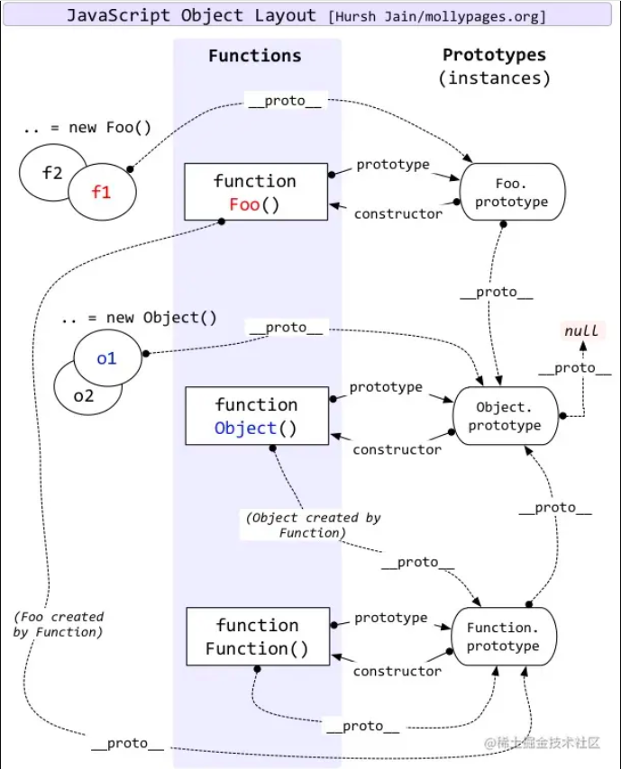

# lang-js

# MDN

## 对象 Object

- JavaScript中一切都是对象。对象是存储在单个分组中的相关功能的集合

## 应用程序接口 API

- API JavaScript 语言核心之上所构建的功能 将为你的代码提供额外的超能力
- 浏览器API,文档对象模型API、地理位置API、画布(Canvas)、WebGL
- 第三方API，google地图API、OpenStreetMap API

## 函数

- 函数内部的代码运行于一个外部代码相互独立的域内

## 比较运算符

- 你可能会看到有些人在他们的代码中使用==和!=来判断相等和不相等，这些都是 JavaScript 中的有效运算符，但它们与===/!
  ==不同，前者测试值是否相同，但是数据类型可能不同，而后者的严格版本测试值和数据类型是否相同。
  ```javascript
  123 == '123'
  true
  123 === '123'
  false
  ```

## 字符串

- 使用反引号声明的字符串是一种特殊字符串，被称为模板字面量。你可以在其中嵌入 JavaScript，你可以声明多行的模板字面量

## this

- 关键字 this 指向了当前代码运行时的对象

## [原型](https://developer.mozilla.org/zh-CN/docs/Web/JavaScript/Inheritance_and_the_prototype_chain)
- 符号 someObject.[[Prototype]] 用于标识 someObject 的原型。内部插槽 [[Prototype]] 可以通过 Object.getPrototypeOf() 和 Object.setPrototypeOf() 函数来访问
- 它不应与函数的 func.prototype 属性混淆，后者指定在给定函数被用作构造函数时分配给所有对象实例的 [[Prototype]]
- 值得注意的是，{ __proto__: ... } 语法与 obj.__proto__ 访问器不同：前者是标准且未被弃用的。在像 { a: 1, b: 2, __proto__: c } 这样的对象字面量中，c 值（必须为 null 或另一个对象）将变成字面量所表示的对象的 [[Prototype]]，而其他键（如 a 和 b）将变成对象的自有属性。这种语法读起来非常自然，因为 [[Prototype]] 只是对象的“内部属性”
- 当继承的函数被调用时，this 值指向的是当前继承的对象，而不是拥有该函数属性的原型对象
- 我们说 new Box(1) 是通过 Box 构造函数创建的一个实例。Box.prototype 与我们之前创建的 boxPrototype 并无太大区别——它只是一个普通的对象。通过构造函数创建的每一个实例都会自动将构造函数的 prototype 属性作为其 [[Prototype]]。即，Object.getPrototypeOf(new Box()) === Box.prototype。Constructor.prototype 默认具有一个自有属性：constructor，它引用了构造函数本身。即，Box.prototype.constructor === Box。这允许我们在任何实例中访问原始构造函数
- 类是构造函数的语法糖，这意味着你仍然可以修改 Box.prototype 来改变所有实例的行为
- 对象字面量（没有 `__proto__` 键）自动将`Object.prototype` 作为它们的 `[[Prototype]]`,数组字面量自动将 `Array.prototype` 作为它们的 `[[Prototype]]`,正则表达式字面量自动将 `RegExp.prototype` 作为它们的 `[[Prototype]]`

